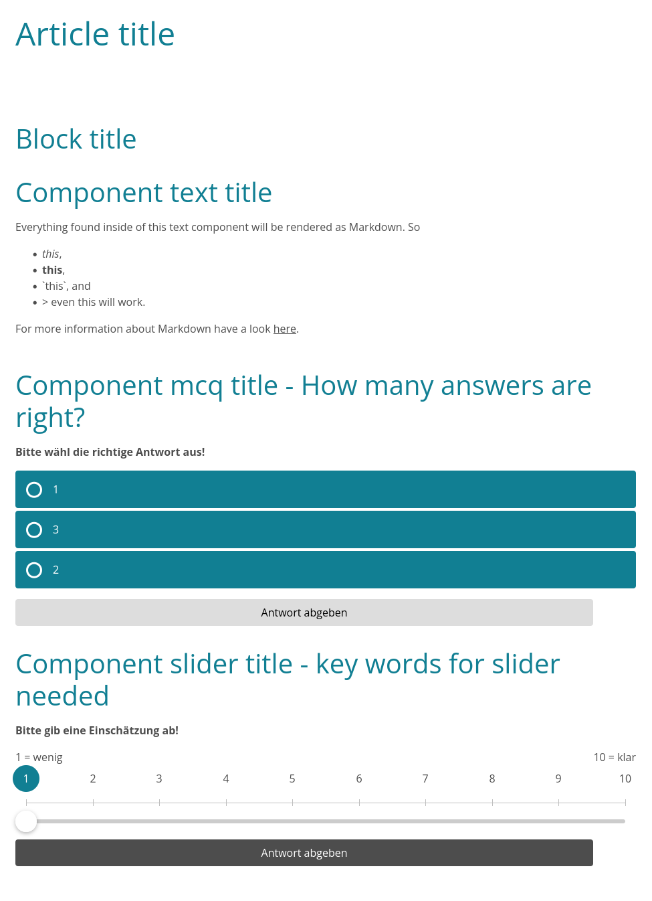
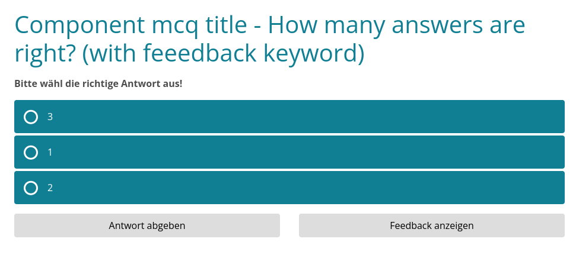
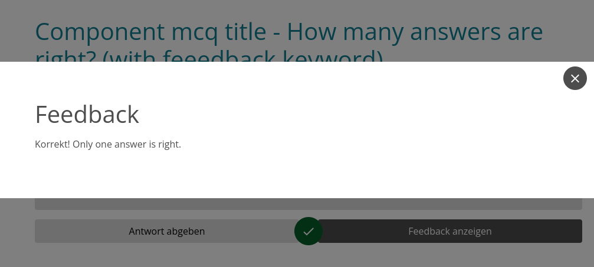

# md2adapt

**md2adapt** is a command-line tool that converts Markdown (`.md`) files into the [Adapt learning](https://www.adaptlearning.org/) content format.

## Required Software

Before running **md2adapt**, make sure you have the following software installed:

- **Python 3.7+**  
  The tool is written in Python.
- **pip**  
  For managing Python packages.
- **(Optional) Adapt Authoring Tool**  
  For importing output into a full Adapt deployment.
- **Existing Adapt Course** 
An Adapt course should already be set up before running the script (although the necessary JSON files will be generated). You can create a course using the [Adapt CLI](https://github.com/adaptlearning/adapt-cli).
  Example:
  ```bash
  mkdir -p /path/to/your/adapt-couse
  cd /path/to/your/adapt-couse
  npm install -g adapt-cli
  adapt create course
  ```

## Installation

Clone this repository and install dependencies:

```bash
git clone https://github.com/com-digi-s/Markdown2Adapt.git
cd Markdown2Adapt
pip install -r requirements.txt
```

## Usage

To convert a Markdown file to an Adapt course format, use the following command:

```bash
python md2adapt.py --out /path/to/your/adapt-course/src/course/en /path/to/your/markdown-template.md
```

To preview the generated JSON files, simply run the script and specify any output directory you prefer.
```bash
python md2adapt.py --out ./output /path/to/your/markdown-template.md
```

## Current Mapping

The given [Markdown sample](./resources/sample.md) will look like this in Adapt:


### mcq can be given with feedback

```Markdown
### Component mcq title - How many answers are right? (with feeedback keyword)

* [x] 1
* [ ] 2
* [ ] 3
Feedback: Only one answer is right.
```

