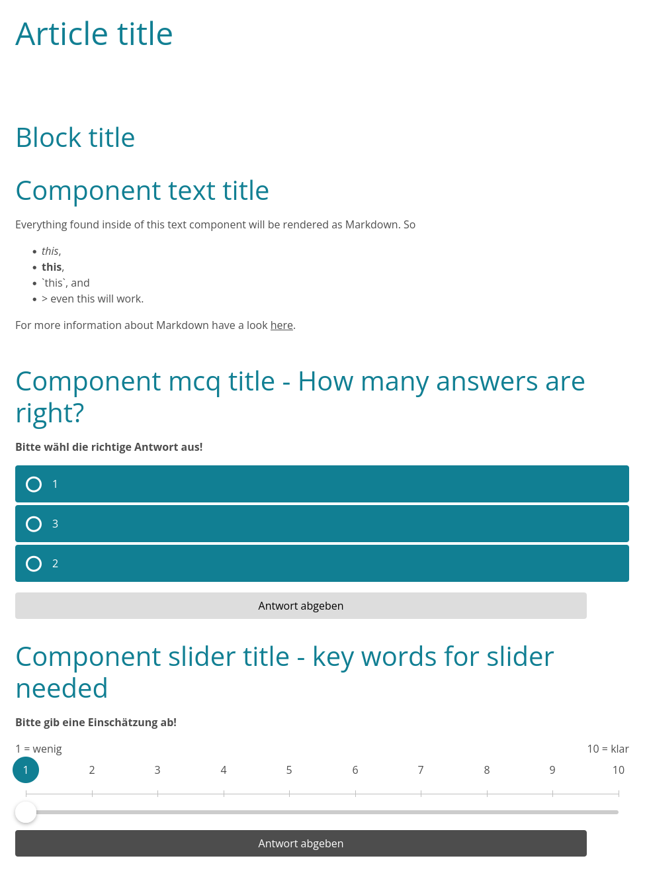
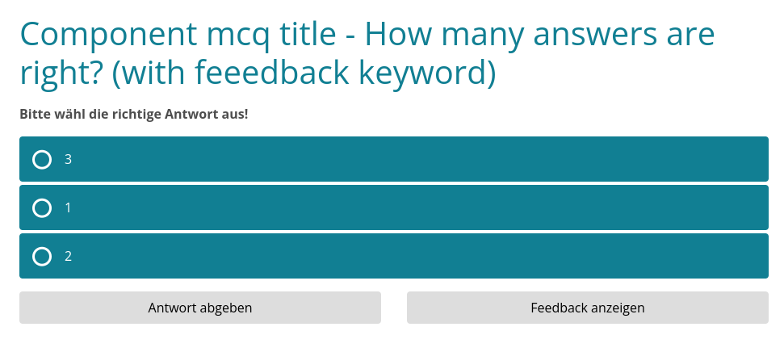
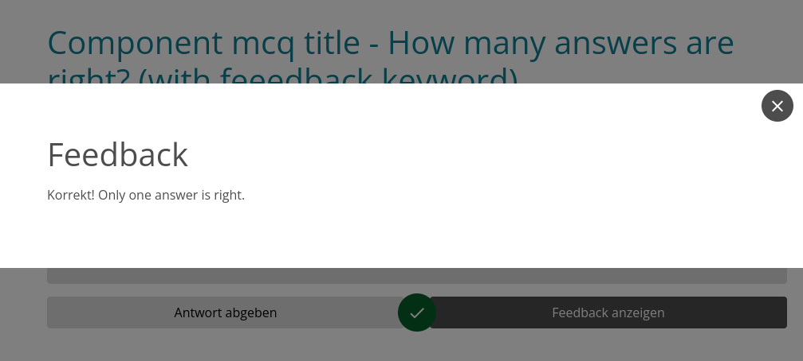

# md2adapt

**md2adapt** is a command-line tool that converts Markdown (`.md`) files into the [Adapt learning](https://www.adaptlearning.org/) content format.

## Required Software

Before running **md2adapt**, make sure you have the following software installed:

- **Python 3.7+**  
  The tool is written in Python.
- **pip**  
  For managing Python packages.
- **(Optional) Adapt Authoring Tool**  
  For importing output into a full Adapt deployment.
- **Existing Adapt Course** 
An Adapt course should already be set up before running the script (although the necessary JSON files will be generated). You can create a course using the [Adapt CLI](https://github.com/adaptlearning/adapt-cli).
  Example:
  ```bash
  mkdir -p /path/to/your/adapt-couse
  cd /path/to/your/adapt-couse
  npm install -g adapt-cli
  adapt create course
  ```

## Installation

Clone this repository and install dependencies:

```bash
git clone https://github.com/com-digi-s/Markdown2Adapt.git
cd Markdown2Adapt
pip install -r requirements.txt
```

## Usage

To convert a Markdown file to an Adapt course format, use the following command:

```bash
python md2adapt.py --out /path/to/your/adapt-course/src/course/en /path/to/your/markdown-template.md
```

To preview the generated JSON files, simply run the script and specify any output directory you prefer.
```bash
python md2adapt.py --out ./output /path/to/your/markdown-template.md
```

## Current Mapping

The given [Markdown sample](./resources/sample.md) will look like this in Adapt:


### mcq can be given with feedback

```Markdown
### Component mcq title - How many answers are right? (with feeedback keyword)

* [x] 1
* [ ] 2
* [ ] 3
Feedback: Only one answer is right.
```



### Component metadata in Markdown

Component chunks can include metadata lines in `key: value` syntax. These lines
are removed from the rendered content and used to control parsing and the
generated component JSON. Their position inside the component does not matter.

Example:

```Markdown
### Match the items

- Benutzerrechte
_isRandom: False
  - [x] Schlüssel und Zutrittsregeln
  - [ ] Das Gebäude
- Administratorrechte
_isRandomQuestionOrder: True
  - [x] Verwaltung und Freigaben
  - [ ] Das Gebäude
```

Supported values include `True`/`False`, numbers, quoted strings, arrays, and
objects. Underscore-prefixed Adapt options such as `_isRandom` use the same
`key: value` syntax.

### Component type inference

Component types are inferred from the remaining syntax after metadata lines are
removed:

- MCQ: flat checklist answers like `* [x] ...`
- Slider: `scale:` plus optional `labelStart:` / `labelEnd:`
- Matching: top-level `- Question` items with nested `- [x] Answer` options
- Reflection: `placeholder:` line
- Accordion: repeated standalone `**Title**` item headings

Explicit `type: matching`, `type: reflection`, `type: accordion`, `type: mcq`,
and `type: slider` still work, but they are optional when the syntax is already
distinctive.
